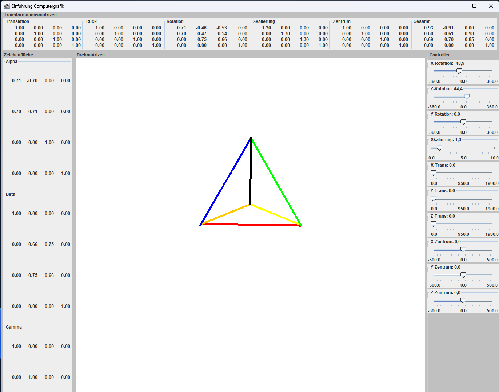
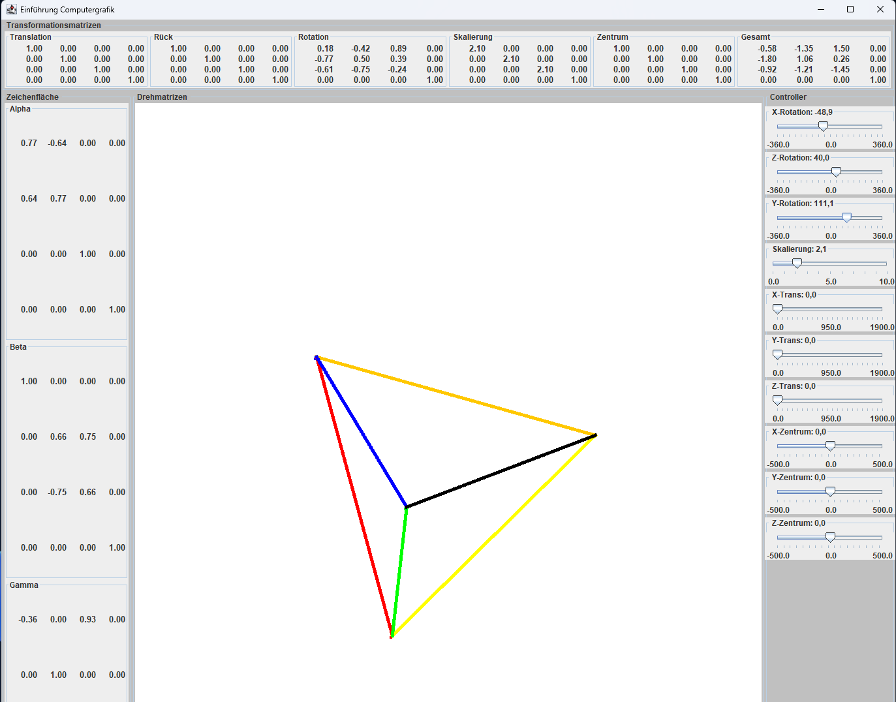

# Triangle-Transformation
A Tool to transform and rotate a Triangle using Java Swing. 

**Julius Steinbach** 
 
Modul: Einführung in die Computergrafik  
Betreuer: Prof. Dr. Fritz Nikolai Rudolph
Trier, 03.06.2023

## Projektbeschreibung
Dieses Projekt entstand im Rahmen des Moduls *Einführung in die Computergrafik*. Ziel war es, ein interaktives Java-Swing-Programm zu entwickeln, das grundlegende 2D-Transformationen auf eine Liste von 3D-Punkten anwendet und die Ergebnisse grafisch darstellt.
Die Klassen Gauss, Matrix, MatrixView und MatrixViewFloat wurde dabei von Prof. Rudolph bereitgestellt.

## Funktionsumfang

###  Zeichenfläche
Das Programm öffnet ein Fenster mit einer Zeichenfläche, auf der eine Liste von 3D-Punkten dargestellt wird. Die Darstellung kann in drei Modi erfolgen:

- **Punktwolke** (einzelne Punkte)
- **Linien zwischen Punktpaaren**
- **Polygonzug** (verbundene Linien durch alle Punkte)

### Transformationen
Die Punktliste wird durch eine **Transformationsmatrix** verändert, die folgende Operationen unterstützt:

1. **Rotation** um einen Punkt/Achse in der Bildebene  
2. **Skalierung** bezogen auf denselben Mittelpunkt  
3. **Translation** (Verschiebung) des gesamten Objekts
4. **Zentrumsverschiebung**  um das Koordinatenzentrum der Zeichenfläche zu verschieben
   

Die Matrizen für die einzelnen Transformationen sowie die Gesamtmatrix werden intern berechnet und können angezeigt werden.

## Randbedingungen
- Java Swing
- 2D Rendering über Graphics2D
- Mathematische Operationen auf 3x3-Matrizen 
